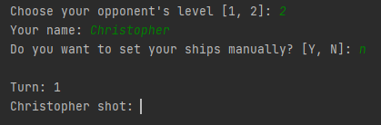
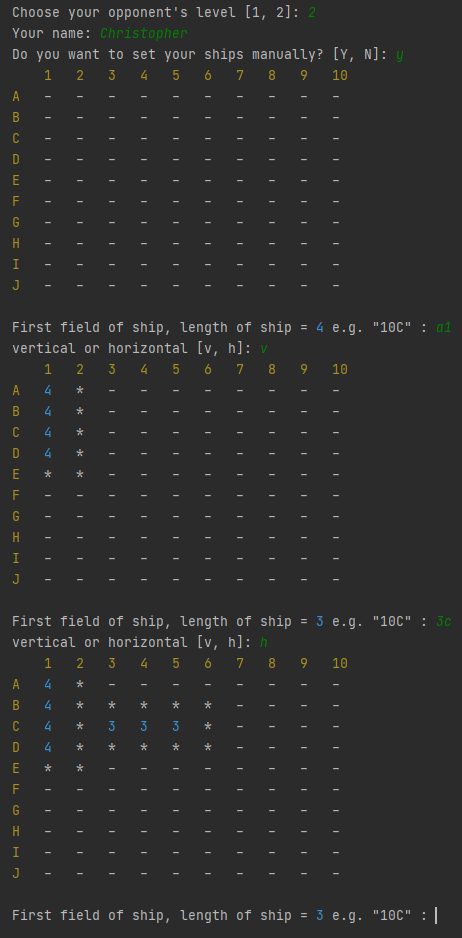
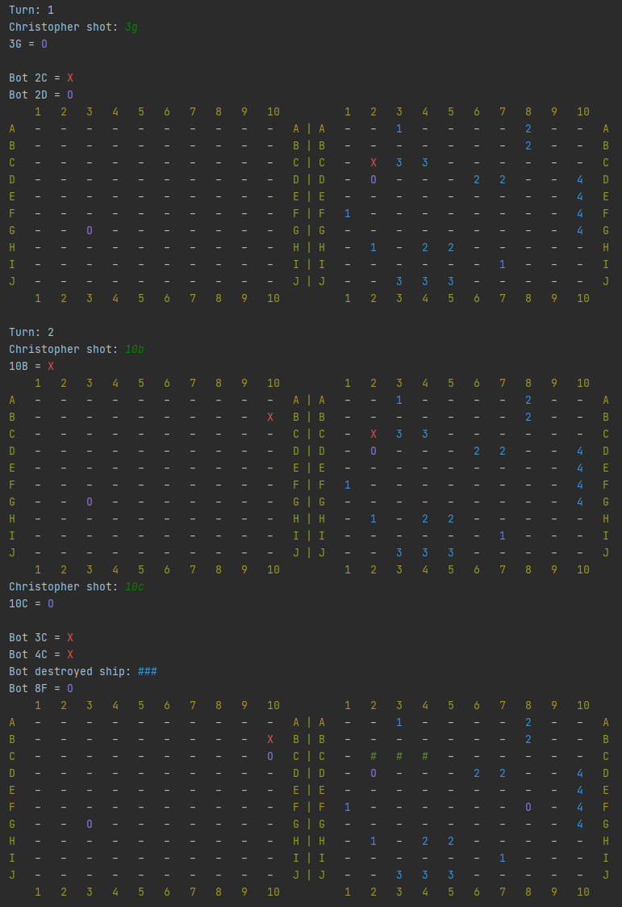
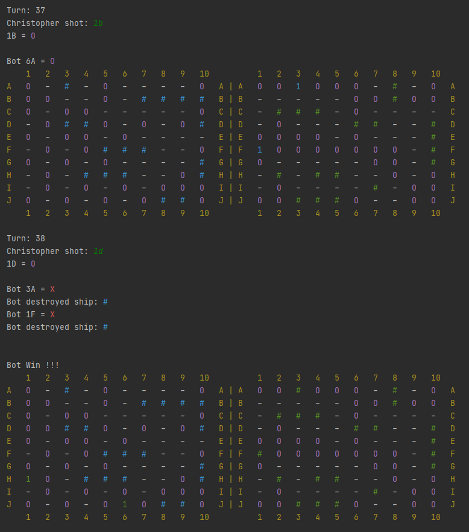

# Ships game
* The game was created with player vs bot in mind, but you can easily make the algorithms duel. All you need to do is change the third argument `kind_of_shot` on number of algorithm when creating an object of class "Player".
* The player can position the ships himself `Y` or use the automatic deployment option `N`.
* Both field coordinates are given in one answer. The rows are given `A-J`, and the columns are given `1-10`. The order does not matter.

### Table of contents
* [Description](#ships-game)
* [Requirements](#requirements)
* [Rules of the game](#rules-of-the-game)
* [Course of the game](#course-of-the-game)

### Requirements
* [colorama](https://pypi.org/project/colorama/)
* [pyinputplus](https://pypi.org/project/PyInputPlus/)  
It is recommended to run the program in an IDE such as PyCharm. In the default console, the game board may be displayed incorrectly or without colors.

### Rules of the game
* Each player has 10 ships: 1 x 4 fields, 2 x 3 fields, 3 x 2 fields, 4 x 1 fields.
* Ships can not be touch each other, even corners.
* In one turn players have minimum one shoot. If any player hits a ship, he shoots until he will have not fail.
* Win player who first destroyed all opponent's ships.

### Course of the game
* <b>Opponent level:</b> Currently are 2 levels. The third level is not yet finished. 
`1` - easy 
`2` - medium 
* <b>Kind of ship deployment:</b> `Y` - manually, `N` - automatically. 
When you select automatically method, algorithm set ships for you. 
  
When you select manually method, you must set all ships on sheet. Give coordinates first field of ship e.g. `10C` 
Next give direction: `v`ertical or `h`orizontal 
  
When you have ships deployed. You can start the game. 
empty = `-` 
hit = `X` 
fail = `O` 
destroyed = `#` 
  
End game 
 
